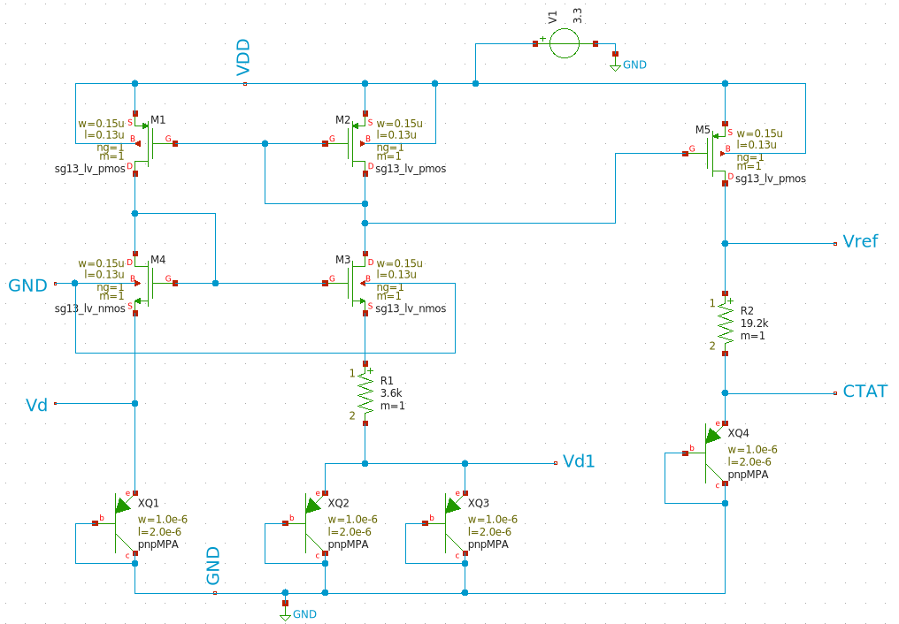
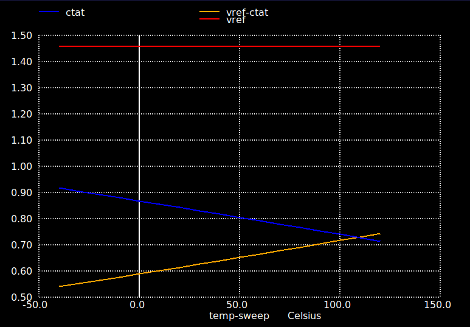
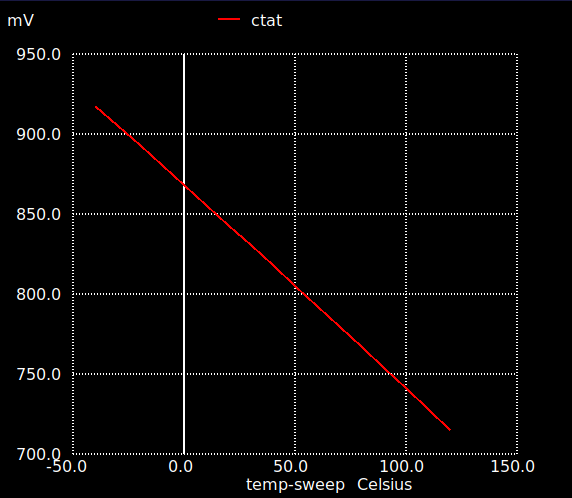
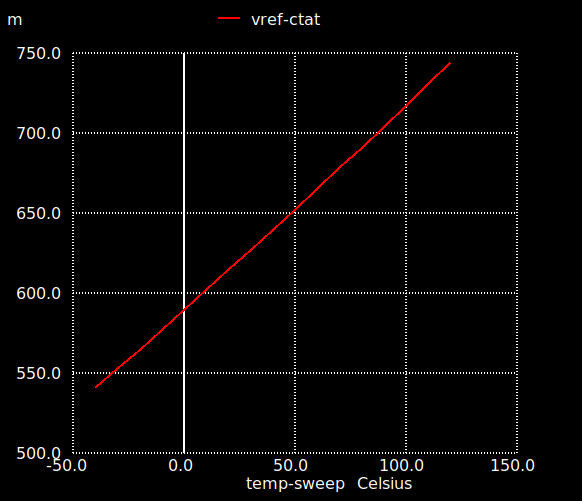
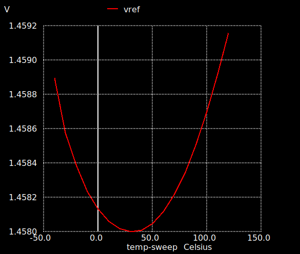
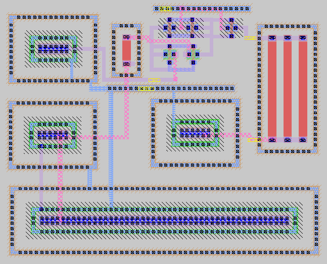
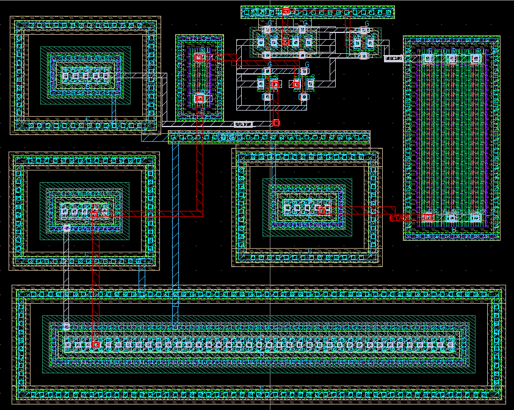

# CMOS-Bandgap-Reference-Circuit

Design and layout implementation of bandgap reference circuit with IHP 130nm PDK

# SCHEMATIC DESIGN

# ANALYSIS

DC ANALYSIS

CTAT PLOT

Vref-CTAT PLOT

Vref PLOT

# LAYOUT DESIGN

